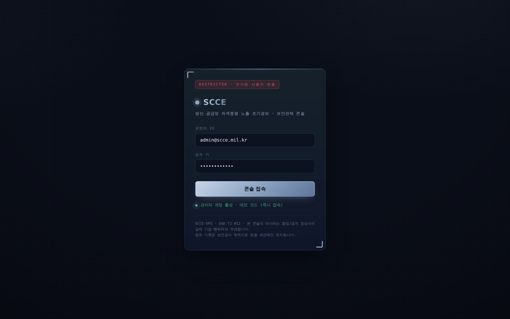
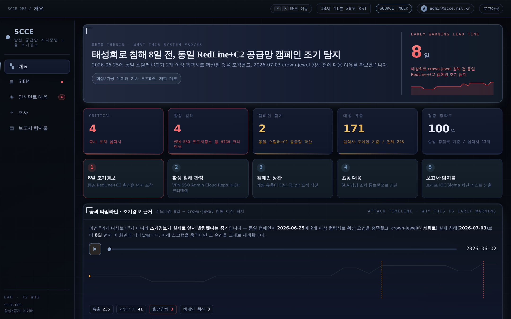
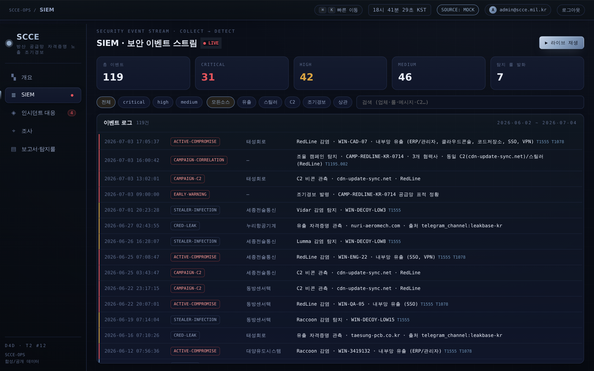
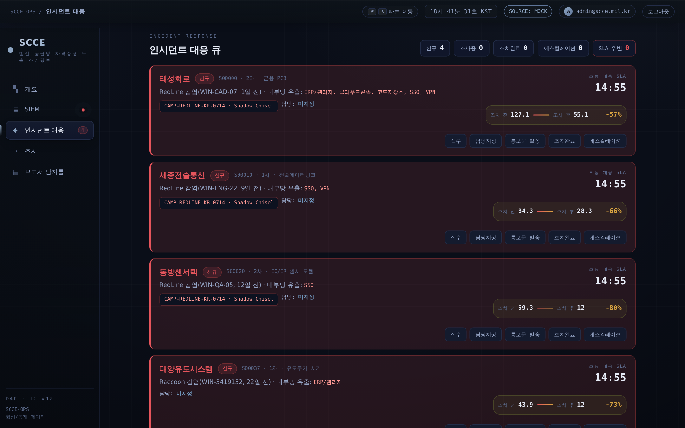
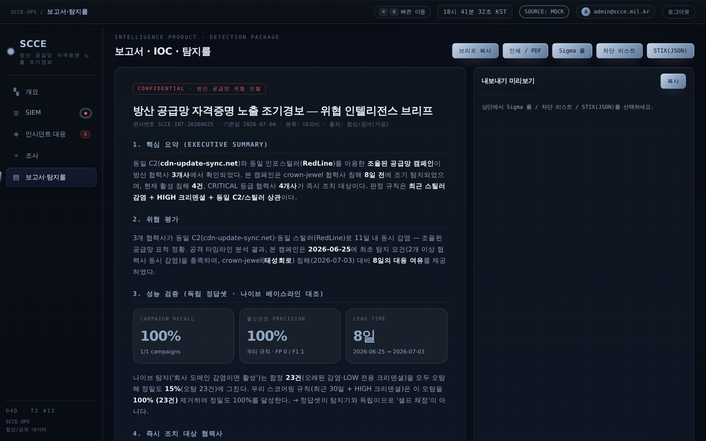

# SCCE — 방산 공급망 자격증명 노출 조기경보

> **D4D Seoul · Track 2 (OSINT & Defense Intelligence) · 문제 #12**
> 방산 1·2차 협력사의 다크웹 유출 자격증명·인포스틸러 감염을 자동 상관해, 활성 침해와
> 조율된 공급망 캠페인을 **본격 침해 이전에** 조기경보하고 즉시 조치를 자동 안내하는 SOC 콘솔.

| | |
|---|---|
| **트랙** | Track 2 · OSINT & Defense Intelligence |
| **문제** | #12 방산 공급망 자격증명 노출 조기경보 (StealthMole 앵커) |
| **핵심 지표** | 조기경보 리드타임 **8일** · Campaign Recall **100%** · Active Precision **100%** |
| **실행 환경** | 오프라인 완주 가능 (외부 의존성 0, CDN 불요) — `./run.sh` 또는 `python3 pipeline.py` |
| **검증** | `python3 scripts/verify_demo.py`, `python3 scripts/test_adapters.py` |

---

**D4D T2 #12** (StealthMole 앵커). 방산 1·2차 협력사 도메인 대상으로 유출 자격증명·인포스틸러
감염기기를 자동 상관하여 **업체별 위험 순위**를 산출하고, **활성 침해**에는 가중치를 높여
**즉시 조치 권고 통보문**을 자동 생성한다. 나아가 여러 협력사에 걸친 **조율된 공급망 캠페인**을
탐지하고, MITRE ATT&CK 매핑·IOC 추출·신뢰도/출처(citation)까지 제공하는 CTI 콘솔.

> Supply-Chain Credential Exposure · Early Warning

## 스크린샷

|  |  |
|---|---|
|  |  |
| 작전 콘솔 접속 (관리자 계정 활성 · 데모 모드) | 개요 — KPI · 조기경보 리드타임 · 위험 순위 |
|  |  |
| SIEM 이벤트 스트림 (collect → detect) | 인시던트 대응 큐 — SLA · 조치 전/후 잔여위험 |
|  | |
| 인텔 브리프 — 독립 정답셋 기준 성능 검증 포함 | |


## 핵심 정의 — 무엇을 계산하는가

**SCCE는 협력사의 보안 수준(CVSS류 취약점 점수)을 평가하지 않는다.** MFA·보안장비 도입 여부는 보지 않는다.
대신 유출·감염·상관 **증거**만으로 **현재 침해 가능성(Compromise Likelihood)**을 계산한다.

> ❌ Security Weakness Score — "이 회사는 보안이 취약하다"
> ✅ Compromise Likelihood Score — "이 회사는 지금 뚫렸거나 뚫리는 중일 가능성이 높다"

한 문장으로: **"협력사의 보안 수준을 평가하는 시스템이 아니라, 여러 보안 증거를 종합해 지금 가장 먼저 대응해야 할
협력사를 찾아주는 AI 기반 공급망 침해 조기경보 시스템."** SIEM·Evidence Ledger·Campaign Correlation·
공격 타임라인·대응 권고는 전부 이 하나의 목적을 뒷받침하는 요소다.

### 알려진 한계 — 관측편향(Observability Bias)

**SCCE는 협력사가 실제로 몇 번 침해당했는지 알 수 없다.** 볼 수 있는 건 "침해 사실"이 아니라
"다크웹·인포스틸러 채널에 관측 가능한 흔적을 남겼는가"뿐이다. 어떤 협력사가 10번 뚫렸어도 그 흔적이
공격자 쪽 유통망(재판매·재유출)에 전혀 노출되지 않았다면 SCCE는 그 협력사를 볼 수 없다.

이건 SCCE만의 결함이 아니라 **외부관측 기반 위협 인텔리전스 전체의 구조적 특성**이다 — 관측 여부를 가르는
변수는 회사의 공개 의지가 아니라 **공격자가 그 데이터를 시장에 내놨는가**다. 그래서:

- 크리덴셜을 훔쳐 되파는 **범죄형·상용 스틸러 공격**(RedLine 등)은 회사가 조용히 수습해도 공격자 쪽에서
  흔적이 남는 경우가 많다 — 이게 SCCE가 실제로 잘 잡는 영역이며, 문제 #12가 명시한 범위와도 일치한다.
- 데이터를 되팔지 않는 **국가배후형(APT) 침투**처럼 공격자도 흔적을 남기지 않으려는 경우는 SCCE도 못 본다.

그래서 SCCE는 "관측 신호 없음"을 "안전 확인됨"으로 표기하지 않는다. 상태값에 **`NO SIGNAL — 관측 공백`**을
별도로 두어(`LOW`와 시각적으로도 구분: 점선 테두리·중립 회색), 신호가 없는 협력사를 명시적으로
"증거 없음"이라고만 표시한다. 이 한계를 완전히 없애려면 AI가 아니라 **사고 신고를 의무화하는 계약·규제
장치**가 필요하다 — SCCE의 역할은 그 신고 의무가 없거나 지켜지지 않는 지점에서, 공격자 쪽 흔적을 통해
보완적으로 조기경보를 제공하는 것이다.

---

## 빠른 실행

```bash
# 1) 원커맨드 (데이터 생성 → 파이프라인 → 대시보드 서버)
./run.sh
#   → http://127.0.0.1:8000

# 2) 서버 없이 (오프라인, 인터넷 불요)
python3 scripts/generate_synthetic.py
python3 pipeline.py
open web/login.html      # 로그인 → 대시보드 (더블클릭도 동작)
```

서버용 의존성: `pip install -r requirements.txt` (FastAPI + uvicorn).
대시보드 자체는 **의존성 0** — 시스템 폰트만, CDN·인터넷 불요.

---

## 아키텍처

```
데이터 소스 ──▶ 매처 ──▶ 스코어러 ──┬─▶ MITRE 매핑
(합성/파트너)   (도메인 상관)  (활성침해   ├─▶ IOC 추출
                              지배)     ├─▶ 신뢰도/출처
                                        └─▶ 캠페인 상관 + 그래프
                                              │
                                    report.json ──▶ FastAPI ──▶ SOC 대시보드
                                              └────────────────▶ report_data.js(오프라인)
```

```
d4d-scce/
  run.sh                     원커맨드 실행
  pipeline.py                오케스트레이션
  requirements.txt
  scripts/generate_synthetic.py   합성 데이터 생성기(캠페인·C2·행위자 주입)
  src/
    adapters.py              mock(합성) / partner(StealthMole 스텁) 어댑터
    matcher.py               유출·스틸러 → 협력사 도메인 상관
    scoring.py               위험 스코어링 (A안: 활성침해 지배)
    siem.py                  ★ SIEM 이벤트 스트림 (원시 신호 → 룰 태그 이벤트 · collect→detect)
    correlation.py           ★ 조율된 공급망 캠페인 탐지 + 관계 그래프
    mitre.py                 ATT&CK 기법 매핑
    ioc.py                   IOC 추출
    enrich.py                신뢰도 / 출처(citation) / 타임라인
    replay.py                ★ 공격 타임라인(Attack Timeline) — 일자별 as-of 스냅샷 + 조기경보 리드타임 증거
    recommender.py           즉시 조치 통보문 생성 (LLM 훅 = CMUX 연결부)
  api/server.py              FastAPI: /api/report, /api/vendor, /api/advisory, /api/refresh
  web/                       SOC 대시보드 (login.html + index.html + styles.css + app.js)
  schema/README.md           데이터 스키마 계약서
  data/                      synthetic/*.json, report.json
```

## 핵심 차별점 (심사 포인트)

0. **설명 가능한 판정 + 대응 효과** — 각 협력사 상세에서 Evidence Ledger로 점수 산출 근거를 보여주고,
   인시던트 대응 큐에서 조치 전/후 잔여위험을 계산한다. 보고서 탭에는 Synthetic Ground Truth 평가까지 포함해
   “예쁜 화면”이 아니라 “왜 위험한지·조치하면 얼마나 줄어드는지·검증 결과가 어떤지”를 증명한다.
1. **8일 조기경보 리드타임** — `replay.py`가 동일 RedLine+C2 캠페인의 as-of 확산을 재생해,
   태성회로(crown-jewel) 침해일 2026-07-03보다 **8일 전인 2026-06-25**에 캠페인 탐지 요건을 충족했음을 보여준다.
   → “이미 터진 사고를 보여주는 대시보드”가 아니라 “침해 전에 대응 여유를 만든 조기경보”라는 핵심 가치.
2. **조율된 공급망 캠페인 탐지 (`correlation.py`)** — 개별 업체 점수 나열이 아니라, 같은
   스틸러·같은 C2·같은 시간창으로 **다수 협력사를 동시 타격한 작전**을 하나의 캠페인으로 묶는다.
   “우연한 개별 유출”이 아니라 “공급망을 노린 조율된 표적”이라는 서사. → 문제 배경(APT 표적) 정면 대응.
3. **Compromise Likelihood Score (활성 침해 지배)** — 보안 취약점이 아니라 침해 가능성을 계산한다.
   최근 스틸러 감염 + 내부망 크리덴셜(vpn/sso/admin/cloud/repo)이 다른 신호를 압도하도록 설계했고,
   시간감쇠와 임무영향 승수로 “지금 뚫리는 중 + 뚫리면 치명적”인 협력사를 먼저 올린다.
4. **분석관 즉시 활용 (deployability)** — MITRE 매핑 + IOC 추출 + 신뢰도/출처 + 자동 통보문.
   “내일 바로 쓴다”가 자명 → 심사 배점 최대 항목(군 적용 가능성).
5. **파트너 데이터 무종속** — 공개/합성 데이터로 완주. StealthMole 접근 열리면 `PartnerAdapter`
   3개 메서드만 채우면 끝(파이프라인 불변).

## 스코어링 철학 (A안) — Compromise Likelihood Score

    정적 유출 < 감염 사실 < 활성 침해(최근 + 내부망 크리덴셜)

- 시간 감쇠 `0.5 ** (age/30)` — 30일마다 반감(조기경보 = 최신성).
- 임무 영향은 더하지 않고 곱한다(tier2/임무중요 품목, 최대 ×1.4).
- 대시보드 업체 상세에서 이 계산을 "활성침해/유출/감염기기" 신호 축과 "크리덴셜 종류별"(VPN/SSO/Admin/Cloud/Repo) 축,
  두 방향으로 시각화해 "왜 이 점수인가"를 5초 안에 보여준다.

## 데모 서사 (60~90초)

최종 발표 동선은 **5개 화면**만 사용한다: `개요 → SIEM → 인시던트 대응 → 조사 → 보고서·탐지룰`.

0. **접속 화면** — 작전 콘솔 로그인(관리자 계정 활성, 즉시 접속). "실제 배포된 보안관제 콘솔" 인상.
1. **개요** — KPI에서 `조기경보 리드 8일`, `CRITICAL 4`, `매칭 유출 171/전체 248`을 먼저 보여준다.
2. **공격 타임라인(Attack Timeline) 재생** — "과거 다시보기"가 아니라 조기경보가 실제로 앞서 발령됐다는 증거 재생이다.
   06-22 동방센서텍 감염 → **06-25 세종전술통신 감염 순간 조기경보 발령**
   → 07-03 crown-jewel 태성회로 침해. "**crown-jewel 침해 8일 전에 이미 탐지**"가 핵심.
3. **태성회로 상세 + 캠페인 그래프** — VPN/SSO/클라우드/코드저장소 평문 유출, MITRE, 타임라인, 출처를 보여주고,
   `CAMP-REDLINE-KR-0714` 그래프로 "개별 사고가 아니라 공급망 표적 작전"임을 설명한다.
4. **SIEM / 인시던트 대응 / 조사** — 같은 데이터가 이벤트 스트림, P1 대응 큐, 엔티티 피벗으로 이어지는 분석관 워크플로를 보여준다.
   인시던트 대응 큐에서는 `조치 전 위험 → 조치 후 잔여위험`을 함께 보여 대응 효과를 정량화한다.
5. **보고서·탐지룰** — 인텔 브리프, IOC, Sigma 룰, 차단 리스트, STIX(JSON) 산출로 실무 적용성을 마무리한다.
   브리프에는 Synthetic Ground Truth 기준 Campaign Recall / Active Precision / Lead Time 검증을 포함한다.

## 규정 (B-1) 준수

- 회사명·도메인·행위자·C2 **전부 가공(fictional)**.
- 기존 CMUX(LLM 로그 분석)는 `recommender.llm_summarize()` 훅으로 연결 가능 — 발표 시
  "현재 데모는 오프라인 재현성을 위한 템플릿 기반, CMUX/LLM은 확장 훅"이라고 구분해 설명할 것.
- StealthMole 등 파트너 피드는 현재 `PartnerAdapter` 확장 지점으로 남겨둔 상태다. 발표에서는
  "실제 연동 완료"가 아니라 "피드 접근 시 어댑터만 교체"라고 말한다.

## 제출/발표 보조 자료

- `docs/PITCH_3MIN.md` — 3분 발표 스크립트.
- `scripts/verify_demo.py` — KPI/공격 타임라인/캠페인 서사 일관성 검증.

검증:

```bash
python3 scripts/generate_synthetic.py
python3 pipeline.py
python3 scripts/verify_demo.py
```

## 현재 상태

- [x] 데이터 엔진(캠페인·C2·행위자) / 매처 / 스코어러 / MITRE / IOC / 상관 / 신뢰도 / 통보문
- [x] FastAPI 백엔드 (엔드포인트 검증 완료)
- [x] SOC 대시보드 5개 화면 고정: 개요·SIEM·인시던트 대응·조사·보고서/탐지룰
- [x] 워룸/quarkify/코드노출 기능 삭제 — 발표 초점 분산 제거
- [x] 데모 녹화용 3분 피칭 스크립트 (`docs/PITCH_3MIN.md`)
- [x] KPI/공격 타임라인 서사 검증 스크립트 (`scripts/verify_demo.py`)
- [x] StealthMole 실연결(JWT 인증·CL/CDS 매핑·재시도/캐싱, `scripts/check_stealthmole.py`) — 데모 기본값은 여전히 MockAdapter
- [ ] (옵션) LLM 통보문 다듬기(`recommender.llm_summarize`), 지도 시각화
```
